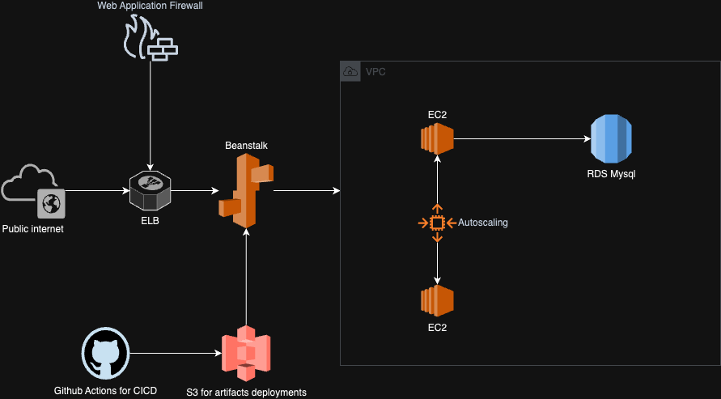

# Terraform Java microservice on AWS Example
This example will create using terraform the necessary infra on AWS to:

- create a REST API written in java
- using a mysql db on RDS
- using a WAF (Web Application Firewall)
- autoscalable
- using CD/CD to deploy the code

## Solution idea
We could use different services to achieve this setup, for ex using API Gaeway + lambda in a more serverless fashion, or creating the solution using ECS.
Another way could be using Elastic Beanstalk, that is an AWS service that helps the setup of web services or sqs workers.

Using beanstalk can be useful because for web services give us:
- an ELB (load balancer) for access the web api that handle the scaling properties
- a set (one or more) ec2 and autoscaling rules associated
- a deploy method: blue/green, canary for the application + deploy logs
- a way to setup rds in the project

## Architecture diagram

## Key points to be done
- [X] terraform for Elastic Beanstalk: setup elb, ec2, autoscaling rule, min-max instances to use and type (using spot in this example in autoscaling but at least 1 ec2 ondemand always on), 
- [X] RDS: instance size, connection port 3306 to be enabled, user/pass and endpoint outputs used by the java service as envs
- [X] ELB: expose the endpoint and arn
- [X] WAF: this service can be connected to ELB, api gw, ... so we need to attach some ACL rules + where to apply this WAF, in this case an ELB
- [X] java code sample: use spring boot to create a simple api that called by a GET endpoint, will print from mysql the version or current date, to test the connection.
- [X] an S3 bucket to store artifacts from the java project, used to update the beanstalk environment
- [X] cicd: use github actions to deploy the code: we need aws cli, access envs for aws, java to test and build the code, calling aws cli to deploy on beanstalk the new version of the code

## Nice to haves omitted in this demo
I have omitted some features for keep things simple for this test, but those can be a nice addition in the future:
- [ ] blue green deploys in beanstalk
- [ ] fleet usage like 1 ondemand, n spot instances etc in beanstalk
- [ ] RDS backups and scaling configuration and snapshot policies
- [ ] S3 lifecycle to remove old artifacts after a while
- [ ] DNS and certificate manager usage for the ELB

## CICD
the steps should be given ENVS aws access and secret, beanstalk arn to deploy:
- prepare: step where we install the requirements: aws cli, java
- build: test and build and package the java code + add ENV for RDS setup
- deploy: run aws cli to deploy on beanstalk

## ENVs used by CICD/java code
- aws access and secret
- RDS endpoints, user, pass
- Beanstalk environment name to known where to deploy

## More info in the specific readme
- [java app readme](./code/README.md)
- [terraform readme](./terraform/README.md)